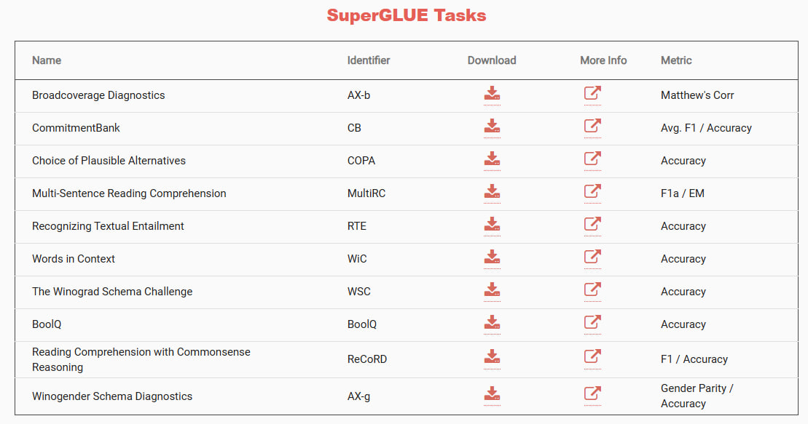

# Data-Augmentation-with-LLMs

Generating synthetic NLP datasets from HF benchmarks (e.g., GLUE MRPC, SuperGLUE CB) using multiple LLM providers (OpenAI GPT, XAI Grok, DeepSeek, Gemini), with batch-style prompting and robust converters to a task-specific JSONL dataset.

**Providers**: gpt (OpenAI), grok (XAI), deepseek (DeepSeek), gemini (Google GenAI).
**Config**: Hydra-driven via per-provider setting.yaml and prompt templates with JSON schema.

---

## Requirements

- Python: `>=3.12`
- Package manager: uv (recommended)
- `API keys (.env):`
- `OPENAI_API_KEY (GPT)`
- `XAI_API_KEY (Grok)`
- `DEEPSEEK_API_KEY`
- `GEMINI_API_KEY` or `GOOGLE_API_KEY (Gemini)`
  Install

**Recommended**: run with uv (no requirements.txt needed).
Packages are pinned in pyproject.toml; uv run resolves them automatically.

---

## Getting Started

- Put keys in .env at repo root.
- Configure model, dataset, subset, shots, batch, gen_per_request in the provider’s setting.yaml.
  Generated dataset is saved to `data/{model}/{task}/generated/synthetic.jsonl`.
  For compatibility, files are also mirrored at the legacy path `data/{task}/{model}/synthetic.jsonl`.

`settings.yaml`

- `batch` &rarr; number of requests saved per batchinput, if its 1, each file will be 1 request line (lost of small files)
- `shots` &rarr; number of few-shot exemplars pulled from the HF dataset per request.

  With shots: 5, each request shows 5 real examples to the model as guidance.

- `gen_per_request` &rarr; number of new synthetic examples the prompt asks the model to generate per request.

  With gen_per_request: 5, each request asks for 5 new examples

**Potential problem**: If some of the generation does not work as expected, it may be because the sdk have not been added on your end locally

For OpenAI: `uv add openai`
For XAI (Grok): `uv add xai_sdk`
For gemini: `uv add google-genai`

---

## Current Benchmarks and Tasks supported:



- [SuperGLUE](https://super.gluebenchmark.com/tasks/)
  - CB
  - RTE (testing)
  - COPA, WSC, WiC, BoolQ, MultiRC

---

## Generating Data

### GPT (OpenAI gpt-4o-mini)

1. Make sure you setup `.env` and `gpt/setting.yaml`
   - Add your XAI_API_KEY into the .env file
   - Editting the `setting.yaml` in the `grok` folder accordingly
2. To generate batch files, `uv run python .\gpt\prompt.py`
3. To submit batch files to generate, `uv run --env-file .env python .\gpt\generate.py`
4. To retreive the result of batch, `uv run --env-file .env python .\gpt\retreive.py`
5. To convert jsonl batch output into clean data, `uv run python .\gpt\convert_to_dataset.py`

---

### Grok (grok-3-mini)

Make sure you setup `.env` and `grok/setting.yaml`

- Add your XAI_API_KEY into the .env file
- Edit the `setting.yaml` in the `grok` folder accordingly

#### SuperGLUE

Use these four commands for any supported task. Replace `<dataset>` and `<subset>` accordingly.

```
uv run python "grok/grok_prompt.py" dataset=<dataset> subset=<subset>
uv run python "grok/grok_generate.py" dataset=<dataset> subset=<subset>
uv run python "grok/grok_retreive.py" dataset=<dataset> subset=<subset>
uv run python "grok/grok_convert_to_dataset.py" dataset=<dataset> subset=<subset>
```

 - For SuperGLUE on HF, use `dataset=super_glue` and one of:
   `cb`, `rte`, `copa`, `wsc`, `wic`, `boolq`, `multirc`, `record`.
   Diagnostics `axb` and `axg` are test-only (no train split).

---

### Deepseek (deepseek-chat)

1. Make sure you setup `.env` and `deepseek/setting.yaml`
   - Add your `DEEPSEEK_API_KEY` into the .env file
   - Editting the `setting.yaml` in the `deepseek` folder accordingly
2. [WORKING] To generate batch files, `uv run python .\deepseek\deepseek_prompt.py`
3. To submit batch files to generate, `uv run --env-file .env python .\deepseek\deepseek_generate.py`
4. To retreive the result of batch, `uv run --env-file .env python .\deepseek\deepseek_retreive.py`
5. To convert jsonl batch output into clean data, `uv run python .\deepseek\deepseek_convert_to_dataset.py`

---

### Gemini (gemini-2.5-flash-lite)

1. Make sure you setup `.env` and `gemini/setting.yaml`
   - Add your `GEMINI_API_KEY` into the .env file
   - Editting the `setting.yaml` in the `gemini` folder accordingly
2. [WORKING] To generate batch files, `uv run python .\gemini\gem_prompt.py`
3. To submit batch files to generate, `uv run --env-file .env python .\gemini\gem_generate.py`
4. To retreive the result of batch, `uv run --env-file .env python .\gemini\gem_retreive.py`
5. To convert jsonl batch output into clean data, `uv run python .\gemini\gem_convert_to_dataset.py`

---

## Just some notes

– **CB (CommitmentBank) — Train ≈ 250:** NLI on short texts; tests subtle pragmatic entailment vs. non‑entailment. Source: CommitmentBank. Metric: accuracy + macro‑F1 (small, imbalanced).
– **COPA (Choice of Plausible Alternatives) — Train ≈ 400:** Commonsense causal reasoning — choose the more plausible cause/effect. Source: COPA. Metric: accuracy.
– **WSC (Winograd Schema Challenge) — Train ≈ 554:** Coreference with pronoun disambiguation requiring world knowledge. Source: Winograd schemas. Metric: accuracy.
– **RTE (Recognizing Textual Entailment) — Train ≈ 2,490:** Classic NLI — does the premise entail the hypothesis? Source: PASCAL RTE. Metric: accuracy.
– **WiC (Word‑in‑Context) — Train ≈ 5,428:** Word sense disambiguation — same word, same sense across two sentences? Source: WiC. Metric: accuracy.
– **BoolQ (Boolean Questions) — Train ≈ 9,427:** Yes/No QA from real user queries; requires passage understanding. Source: Google queries + passages. Metric: accuracy.
– **MultiRC (Multi‑Sentence Reading Comprehension) — Train ≈ 27k instances:** Multi‑answer QA per question; evaluates evidence aggregation across sentences. Source: MultiRC. Metrics: macro/micro F1 (instance‑ and question‑level).
– **ReCoRD (Reading Comprehension with Commonsense Reasoning) — Train ≈ 100k+ queries:** Cloze‑style entity fill from news; needs coreference + commonsense reasoning. Source: news articles. Metrics: F1 / EM.

Diagnostics (no train split):
– **AX‑b (Broadcoverage Diagnostics):** Probes lexical semantics, predicate‑argument structure, logic, coreference, and world knowledge. Diagnostic reporting only; excluded from aggregate score.
– **AX‑g (Winogender Diagnostics):** Bias/robustness probe for coreference with gendered/neutral occupations. Diagnostic only; excluded from aggregate score.